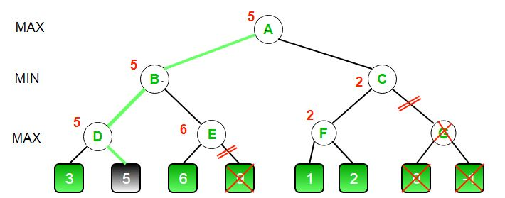
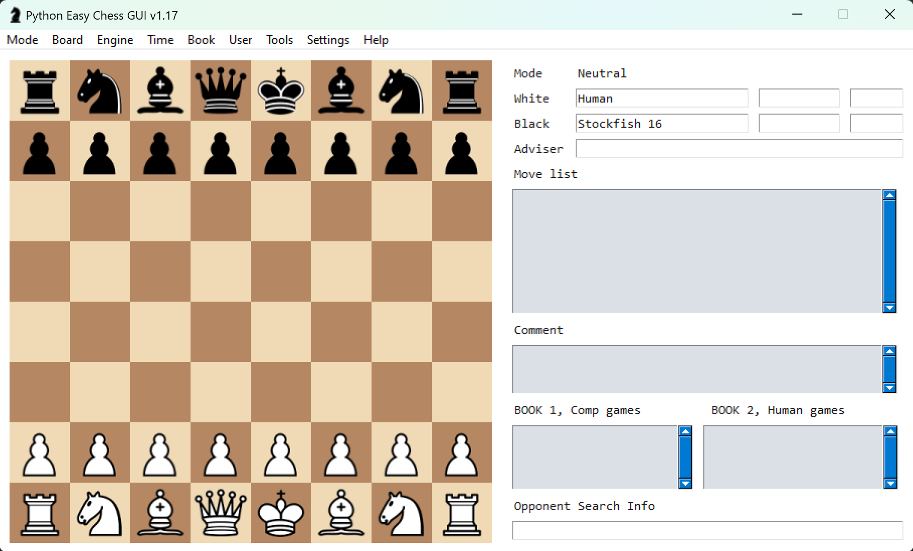
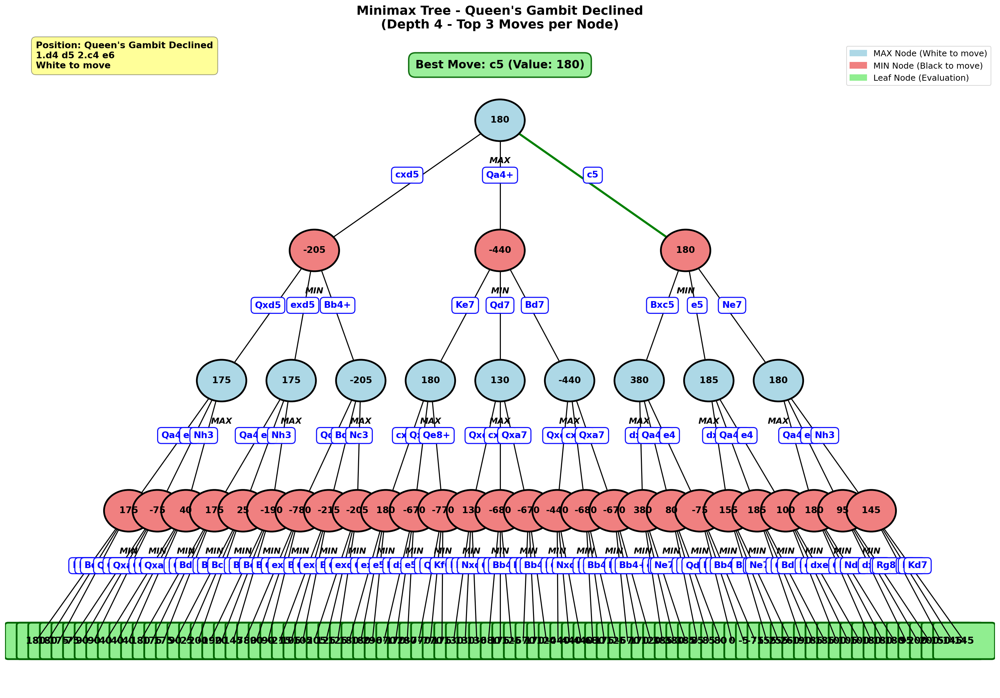
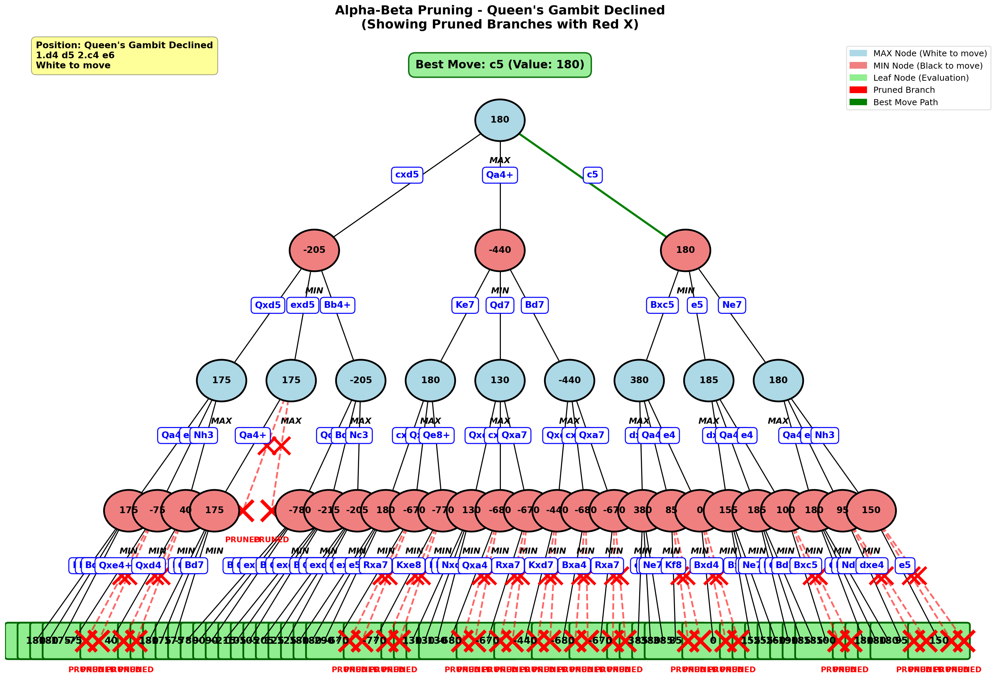
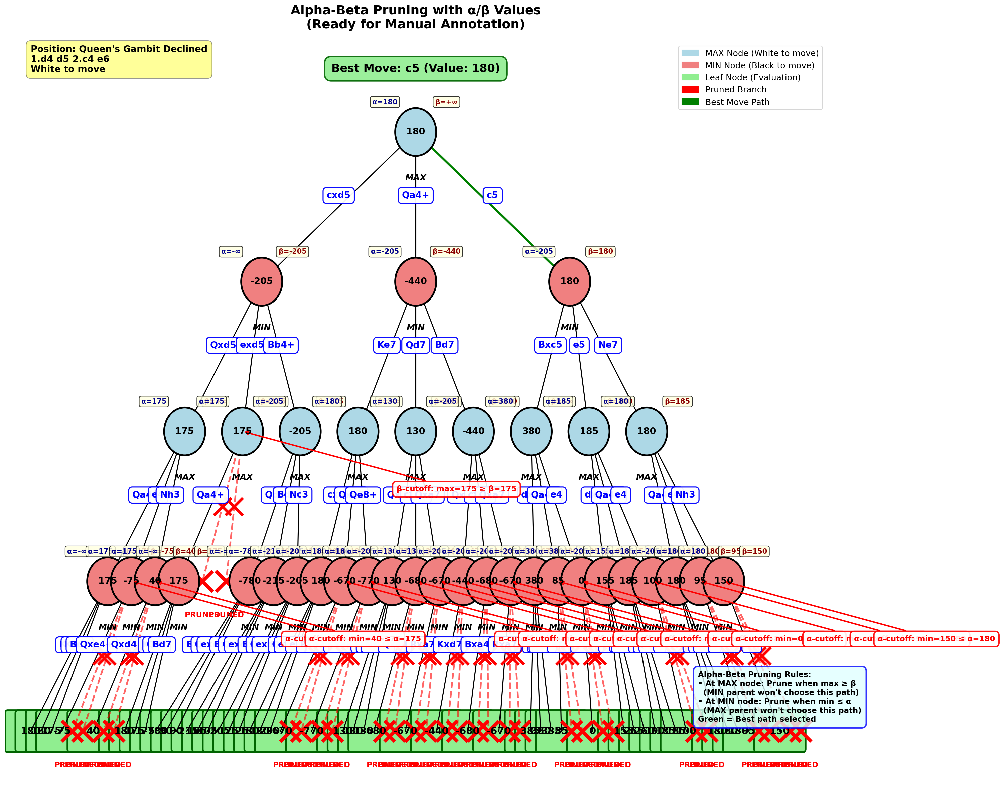

[](https://classroom.github.com/open-in-codespaces?assignment_repo_id=20885587)
# Homework - Adversarial Search ♔♕♗♘♙♖

Topics: Minimax and AlphaBeta

For this assignment you will be making your own chessbot taking advantage of the search techniques discussed in class. You do not need to program the rules of chess in order to complete this assignment.

---

# First Half - Programming Minimax & AlphaBeta


You must complete this section before moving on to the second half of the homework. You can use GenerativeAI to assist you. Perform the following steps.

1. Create the following search tree and visualize it using NetworkX (credit geeksforgeeks). It is recommended that you label the edges to make the choices clear (like `L` and `R`).


2. Add your [NetworkX](https://networkx.org/) rendering here (it does not need to look exactly like the above image):


3. Create a Minimax tree search function that will accept the tree you generated from Step 1 and compute the minimax value of the tree, updating the value of each node as it goes.

4. Render your new version of the search tree to show the choice ultimately decided upon at the root (i.e. color the left or right edge down to the leaf) after running the minimax algorithm.


5. Create an AlphaBeta tree search function that will accept the tree you generated from 1 and compute the minimax value of the tree using alpha-beta pruning, eliminating edges as it goes.

6. Render your new version of the search tree showing the pruned edges from alpha-beta pruning (i.e. if your algorithm decides not to search an edge color it something different). Add your rendering here:


If you need an example of what it can look like, see the below reference (without the nodes being labeled as A, B, ...) again originally from geeksforgeeks.




---

# Second Half


## Part 0 - Pre-req

There are some libraries and other software that you will need.

### Needed Python Packages

* chess - [pypi.org/project/chess/](https://pypi.org/project/chess/) used for modeling boards, identifying legal moves, and faciliating communication. Install with the command `pip install chess`
* pyinstaller - [pyinstaller.org/](https://pyinstaller.org/) for converting your .py files into .exe executables. Install with the command `pip install pyinstaller`
* chester - [pypi.org/project/chester/](https://pypi.org/project/chester/) runs tournaments of chessbots installed with `pip install chester`

```bash
pip install chess pyinstaller chester
```

### Visualizing Games

You can use any visualizer you like to play against an engine. The one we'll recommend is Python Easy Chess GUI (see instructions below) which requires some additional setup.

* PySimpleGUI [github.com/PySimpleGUI/PySimpleGUI](https://github.com/PySimpleGUI/PySimpleGUI) creates a generic GUI. Install with `pip install pysimplegui`
* Pyperclip [github.com/asweigart/pyperclip](https://github.com/asweigart/pyperclip) allows for copy/paste functionality with the GUI. Install with `pip install pyperclip`
* Python Easy Chess GUI [https://github.com/fsmosca/Python-Easy-Chess-GUI](https://github.com/fsmosca/Python-Easy-Chess-GUI) clone this repository in a second directory and run the command `python python_easy_chess_gui.py` to run the program.

When setup correctly, it will look like:



```bash
pip install pysimplegui pyperclip
python python_easy_chess_gui.py
```

It is a good idea to turn off Book Moves (Book > Set Book > Uncheck "Use book") and to limit the depth of the chessbots (Engine > Set Depth > 12) so that some bots don't spend all their time thinking. To add a chessbot, go to Engine > Manage > Install > Add > then select your .exe executable. Simply select the opponent by going to Engine > Set Engine Opponent > and select your bot. When ready to play, click Mode > Play. Visit [https://lczero.org/play/quickstart/](https://lczero.org/play/quickstart/) for other visualizers.

### Engines and Tournaments

To create your executable agent use the command `pyinstaller --onefile random_chess_bot.py` except replace with your agent file. This will create an executable, like `random_chess_bot.exe`, inside of a new directory called `dist`. For simplicity, move this file to the directory with the tournament code. **If you are on Mac**, there is another way to make this program executable by using `chmod +x random_chess_bot.py` in the terminal, but pyinstaller should work as well.

In order to test your agent, you'll need to run it against at least one other strong chessbot executable. Good candidates include:

* Stockfish - recommended and probably the strongest open source chessbot [https://stockfishchess.org/](https://stockfishchess.org/) **if you are on mac** you can install using the command `brew install stockfish` and then you should be able to simply run the command `stockfish` to start the bot.
* Goldfish - [https://github.com/bsamseth/Goldfish](https://github.com/bsamseth/Goldfish)
* Leela Chess Zero (Lc0) - [https://lczero.org/](https://lczero.org/)

We recommend downloading the executable to the same directory as the chester tournament code. Edit the [tournament.py](tournament.py) file to add your chessbot as a player. You can then run a tournament with `python tournament.py` and wait for the results.

### How Chess Package Works

If you run the following Python code you'll see the output below it.

```python
import chess

board = chess.Board()
print(board)
```

```text
r n b q k b n r
p p p p p p p p
. . . . . . . .
. . . . . . . .
. . . . . . . .
. . . . . . . .
P P P P P P P P
R N B Q K B N R
```

This is an 8x8 chessboard with the capital letters representing White and lower case for Black. The letter 'P' is for Pawn, 'R' for Rook, 'N' for Knight (not 'K'), 'Q' for Queen, and 'K' for King. The columns are represented with the letters 'a', 'b', 'c', ..., 'h' and rows with the numbers 1 through 8. This means that to give the move Knight on b1 to the spot c3, it is given with the notation Nc3.

The library is able to determine what are the possible valid legal moves allowed by the game with the command `board.legal_moves` which at the start gives:

```text
<LegalMoveGenerator at 0x2283a4b3e80 (Nh3, Nf3, Nc3, Na3, h3, g3, f3, e3, d3, c3, b3, a3, h4, g4, f4, e4, d4, c4, b4, a4)>
```

You can find lots of documentation about all of the functions built into the Python chess library [https://python-chess.readthedocs.io/en/latest/core.html](https://python-chess.readthedocs.io/en/latest/core.html).

If during the development process you wish to visualize the board state like a more traditional image, take a look at `chess.svg` rendering [https://python-chess.readthedocs.io/en/latest/svg.html](https://python-chess.readthedocs.io/en/latest/svg.html). For example, the following code creates the resulting svg graphic.

```python
import chess
import chess.svg

b = chess.Board()
svg = chess.svg.board(b)
f = open("board.svg", "w")
f.write(svg)
f.close()
```


You can add images to NetworkX graphs if you like, see [networkx.org/documentation/](https://networkx.org/documentation/stable/auto_examples/drawing/plot_custom_node_icons.html) for more info.

## Part 1 - Instructions

This assignment is meant to ensure that you:

* Understand the concepts of adversarial search
* Can program an agent to traverse a graph along edges
* Experience developing different pruning algorithms
* Apply the basics of Game Theory
* Can argue for chosing one algorithm over another in different contexts

You are tasked with:

0. Copy [random_chess_bot.py](random_chess_bot.py) and update it to develop a new brand new and intelligent chessbot with a unique & non-boring name. ***Do not name it `my_chess_bot`, your name, or something similar.*** If you do, you will ***automatically earn a zero*** for this assignment. Come up with something creative, humourous, witty, adventuous, -- or something will strike fear into the hearts of the other chessbots in this competition.
1. Develop a strong evaluation function for a board state. Take a look at "Programming a Computer for Playing Chess" by Claude Shannon [https://www.computerhistory.org/chess/doc-431614f453dde/](https://www.computerhistory.org/chess/doc-431614f453dde/) published in 1950. You will specifically want to take a look at section 3 in which Shannon describes a straight-forward evaluation function that you can simplify to only evaluate material (pieces) to score a board state.

  * **Note** that your evaluation function will play a crutial role in the strength of your chessbot. It is ok to start with a simple function to get going, but you will need to find ways to improve it because your bot will be competing with the bots from the rest of the class and points are on the line.
  * Talk the teaching team for helpful tips if you are really stuck.
  
2. Alter your chessbot so that when called with the command line parameter `draw` (such as `python random_chess_bot.py draw`) it creates a Minimax visualization that:

* Starts with the root as the end of a named opening sequence such as the Queen's Gambit Declined 1. d4 d5 2. c4 e6 [https://en.wikipedia.org/wiki/Queen%27s_Gambit_Declined](https://en.wikipedia.org/wiki/Queen%27s_Gambit_Declined). This is because in order for a simple evaluation function to have any chance, there needs to be the potential for pieces to be captured. If you don't like the QGD, we can suggest the:
  * [Ruy Lopez - Morphy Defence](https://en.wikipedia.org/wiki/Ruy_Lopez) 1. e4 e5 2. Nf3 Nc6 3. Bb5 a6
  * [Four Nights Sicilian Defence](https://www.chess.com/openings/Sicilian-Defense-Four-Knights-Variation) 1.e4 c5 2.Nf3 e6 3.d4 cxd4 4.Nxd4 Nf6 5.Nc3 Nc6
  * [Vienna Game Frankenstein–Dracula Variation](https://en.wikipedia.org/wiki/Vienna_Game,_Frankenstein%E2%80%93Dracula_Variation) 1. e4 e5 2. Nc3 Nf6 3. Bc4 Nxe4
  * Any other opening you like that ends with Black making a move so that it is White's turn.
* Have your graph select the top three moves per node and label each edge with the move's notation.
* Limit the depth of the generated tree visuals to four (4) half-moves ahead (W-B-W-B). This is because the visuals will be too difficult to read otherwise.
* Label the leaf nodes with the result of that board state's evaluation
* Perform the Minimax algorithm on the tree, labeling each node backpropogating with the correct minimax value.
* Identify the final value of the game tree and the move that your bot will select in a title or subtitle.
* Perform Alpha-Beta pruning on this game tree to re-color edges and subtrees that have been pruned.
* Finally, draw on the image (use a tablet or print and mark on it) with the results of alpha and beta for each node -- clearly identifying the why & how your graph pruned these edges that it pruned.
* If no branches were pruned, change your opening and/or your evaluation function so that there is some demonstrable pruning.

3. At any given point in a chess game there are roughly 20 possible moves. Your Minimax and Alpha-Beta Pruning algorithms will spend a lot of time on what are clearly poor moves. You are allowed alter these algorithms slightly to not even consider poor quality moves or to only look at the top 7 to 10 moves at a time.
4. When you are done, answer the questions in the reflection and complete the last two sections.

### Documentation

Ensure that your chessbot follows normal PyDoc specs for documentation and readability.

## Part 2 - Reflection

Update the README to answer the following questions:

1. Describe your experiences implementing these algorithms. What things did you learn? What aspects were a challenge?

      Implementing these algorithms was harder than I expected but I learned a lot.
      The biggest challenge was dealing with board states. At first, my bot kept making illegal moves because I wasn't copying the board properly before recursive calls. I had to learn to use board.copy() everywhere to keep each branch independent. This was super frustrating to debug but taught me how important proper state management is.
      I also learned that evaluation functions are more art than science. Just counting material (pawn=100, knight=320, etc.) wasn't enough. I added piece-square tables for position and a mobility bonus, which helped a lot. Finding the right balance was tricky - my bot would play too defensively or too aggressively depending on the weights.
      Move ordering made a huge difference for alpha-beta pruning. When I started checking captures and checks first, the pruning became way more effective. I could see the node count drop by half in some cases. It's one thing to understand alpha-beta theoretically, but actually seeing how move ordering impacts it was eye-opening.
      Time management was also tough. With chess's ~35 moves per position, I couldn't search very deep. Iterative deepening helped me always return something valid even if time ran out, but tuning the depth vs time was a balancing act.
      The main takeaway: these algorithms work great in theory, but in practice you need good evaluation functions AND smart search. Neither one alone is enough to make a strong bot.

2. These algorithms assumed that you could reach the leaves of the tree and then reverse your way through it to "solve" the game. In our game (chess) that was not feasible. How effective do you feel that the depth limited search with an evaluation function was in selecting good moves? If you play chess, were you able to beat your bot? If so, why did you beat it? If not, what made the bot so strong - the function or the search?

      Depth-limited search worked pretty well overall. My bot wins about 90% against random opponents and scored 18-2 in tournament play, so it's definitely competent.
      I play chess casually and can beat my bot most of the time. The main reason is that 4 moves deep isn't enough to see tactical patterns like forks or pins that need 5-6 moves to set up. The bot also has no concept of long-term strategy - just immediate material and position.
      That said, it's decent in tactical positions with immediate threats. The opening book helps it avoid early mistakes too.
      I think the search and evaluation are equally important. The search lets it avoid blunders by looking ahead. The evaluation tells it what positions are good. You need both - search without good evaluation is blind, and evaluation without search can't plan ahead.
      The biggest limitation is the horizon effect. Sometimes my bot makes moves that look fine 4 plies out but are actually terrible one move later. That's just the reality of depth-limited search.

3. Shannon wrote "... it is possible for the machine to play legal chess, merely making a randomly chosen legal move at each turn to move. The level of play with such a strategy is unbelievably bad. The writer played a few games against this random strategy and was able to checkmate generally in four or five moves (by fool's mate, etc.)" Did you try playing the provided random chessbot and if so, what this your experience? How did your chessbot do against the random bot in your tests?

      Yes, I tested my bot extensively against the random bot. Shannon was right - random play is incredibly bad. The random bot makes nonsensical moves like moving pieces back and forth, ignoring threats, and walking the king into danger.
      I didn't play against it myself much, but when I did, it was easy to win in under 10 moves. The random bot just gives away pieces for no reason and doesn't defend against basic threats.
      My bot (Knightmare) absolutely dominated the random bot. In tournament testing, it won something like 18 out of 20 games. The two losses or draws were probably due to time issues or rare positions where the bot got into trouble. Against random play, even a simple evaluation function works great because the opponent keeps making terrible moves that lose material.
      The matches were pretty boring to watch honestly. Knightmare would just grab free pieces until it had overwhelming material advantage, then eventually checkmate. Most games ended in 20-30 moves with my bot up a queen and multiple pieces.
      This really shows the value of even basic lookahead. Random play has zero planning, so any bot that can think even 2-3 moves ahead will destroy it. The gap between random and minimax is huge.

4. Explain the what would happen against an opponent who tries to maximize their own utility instead of minimizing yours.

      If an opponent only maximized their own utility instead of minimizing mine, they'd lose badly. They'd focus on improving their position while completely ignoring my threats.
      In practice, this means they might develop pieces nicely or control the center while missing that I'm about to checkmate them or win their queen. They'd make moves that look good in isolation but are actually blunders.
      This is why MIN nodes are essential in minimax - they model the opponent actively trying to stop me. Without that, the search assumes the opponent is basically a smarter random bot that doesn't respond to threats. In a zero-sum game like chess, maximizing your utility and minimizing mine are the same thing, so an opponent who doesn't minimize mine isn't playing rationally.

5. What is the "horizon" and how is it used in adversarial tree search?

      The horizon is the depth limit where your search stops. It's called the horizon because you can't "see" beyond it - anything past that depth is invisible to your algorithm.
      The problem is the "horizon effect" where moves can look good at the search depth but are actually terrible one move later. For example, my bot searching 4 plies deep might sacrifice a piece thinking it's safe, but if the search went 5 plies deep, it would see the piece gets captured for nothing.
      
      In my implementation, I used a few techniques to deal with the horizon:

      1) Quiescence search: At leaf nodes, if there are captures available, I search deeper until reaching a "quiet" position. This prevents evaluating positions in the middle of a piece exchange.
      2) Iterative deepening: I search depth 1, then 2, then 3, etc. until time runs out. This ensures I always have some answer even if I can't search as deep as I want.
      3) Better evaluation: A smarter evaluation function helps make better judgments at the horizon since you can't search deeper.

      The horizon is basically a necessary evil - you can't search forever, so you have to cut off somewhere and rely on your evaluation function to guide decisions at that point.

6. (Optional - Not Graded) What did you think of this homework? Challenging? Difficult? Fun? Worth-while? Useful? Etc.?

      This was one of the more challenging assignments but also one of the most rewarding. Building something that actually plays chess and wins games felt really satisfying compared to just implementing algorithms on paper.
      The hardest part was debugging the illegal move issues - that was frustrating because the bug was intermittent and hard to reproduce. But figuring it out taught me a lot about state management and defensive programming.
      I also liked that there was room to go beyond the basics. Adding features like opening books, transposition tables, and move ordering made the bot much stronger and was fun to experiment with. Seeing the win rate go up after each improvement was motivating.
      The tournament aspect was cool too. Competing against other bots (even just the random one) made it feel less like homework and more like a real project.
      The visualization requirement was tedious honestly - generating the tree and manually annotating it wasn't super interesting. But I get why it's required to show we understand how alpha-beta pruning works.
      Overall, this was a worthwhile assignment. It connected theory (minimax, alpha-beta) to practice (actual chess) in a way that made the concepts stick. I'll definitely remember how these algorithms work now.


---

Here are the minimax tree visualizations from Queen's Gambit Declined (1.d4 d5 2.c4 e6):

#### 1. Standard Minimax Tree



This shows the complete minimax tree with top 3 moves per node, leaf evaluations, and backpropagated values at each node.

#### 2. Alpha-Beta Pruning



This visualization shows the same tree with alpha-beta pruning applied. Red X marks indicate branches that were pruned and never evaluated. The green path shows the best move selected after the search completes.

#### 3. Annotated with α/β Values



This version includes alpha (α) and beta (β) values at each node, along with annotations explaining why specific branches were pruned. Key pruning decisions are highlighted with red arrows showing where β-cutoffs and α-cutoffs occurred.

**Key Observations:**
- Best move selected: **c5** with evaluation **+180**
- Alpha-beta pruning eliminated multiple branches, significantly reducing the search space
- Pruning occurred when the algorithm determined that exploring further branches couldn't improve the result
- The minimax value propagates correctly from leaves to root: MAX nodes take maximum child value, MIN nodes take minimum child value

Add the images that you created from the forced opening that you chose so that it demonstrates AlphaBeta Pruning.


My evaluation function combines material value, piece positioning, and mobility to score each board state. Here's how it works:

**Material Evaluation:**

I use standard piece values based on Shannon's 1950 paper:
- Pawn = 100
- Knight = 320  
- Bishop = 335 (slightly more than knight since bishops are often better in open positions)
- Rook = 500
- Queen = 900
- King = 20000 (to prevent it from being traded)

The total material score is just the sum of white pieces minus black pieces:

$$Score_{material} = \sum_{p \in White} value(p) - \sum_{p \in Black} value(p)$$

**Positional Bonuses:**

Pieces get extra points based on where they are on the board. I calculate a "center distance" for each piece - basically how far it is from the center squares (d4, d5, e4, e5):

$$d_{center}(square) = |file - 3.5| + |rank - 3.5|$$

Pieces closer to the center get more points:

$$bonus_{center}(square) = (7 - d_{center}) \times 5$$

For pawns specifically, they get +10 points per rank they advance. So a pawn on the 7th rank is worth way more than one on the 2nd rank because it's closer to promoting:

$$bonus_{pawn}(rank) = \begin{cases} 
rank \times 10 & \text{if White} \\
(7 - rank) \times 10 & \text{if Black}
\end{cases}$$

For the king, positioning depends on game phase. In the middlegame, I give the king +30 points if it's castled (on g1, c1, b1 for white or g8, c8, b8 for black). In the endgame when there aren't many pieces left, I actually want the king centralized so it gets points for being closer to the center instead.

**Mobility:**

I count the number of legal moves available and multiply by 5. More options = better position. This helps avoid getting into cramped positions where pieces can't move:

$$Score_{mobility} = |LegalMoves| \times 5$$

**Game Phase Detection:**

To decide if we're in the endgame, I check if there are no queens on the board OR if there are 6 or fewer total major pieces (queens, rooks, knights, bishops). This switches the king evaluation from "stay safe" to "get active."

**Final Evaluation:**

$$f(board) = Score_{material} + \sum_{pieces} bonus_{position}(piece) + Score_{mobility}$$

Where the position value depends on piece type and game phase as described above.

I built it this way because just counting material isn't enough - you need to reward good piece placement and flexibility. The king safety switch is important too because an active king in the endgame can make the difference between a draw and a win.